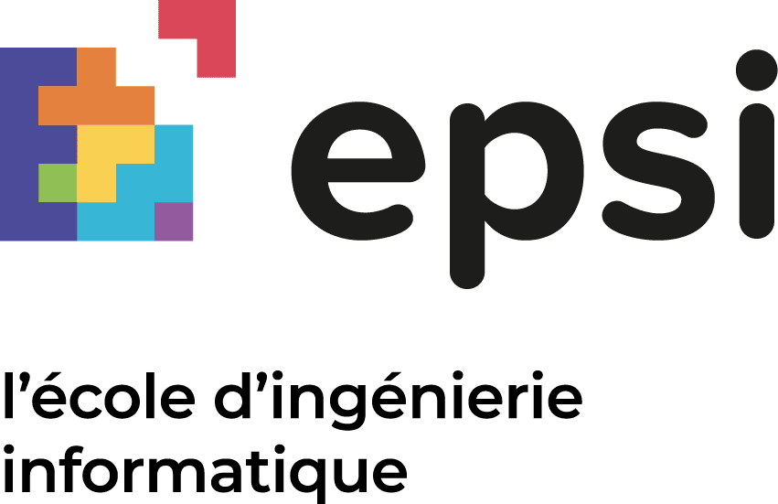

<div align="center">


# Mission Navis - Escape Tech

### Jeu d'énigmes collaboratif en temps réel

[](https://www.epsi.fr/) &nbsp;&nbsp;&nbsp;&nbsp; [](https://www.wis-ecoles.com/)

---

**WORKSHOP 4ème année EPSI/WIS**  
**"ESCAPE TECH : CRÉE TON AVENTURE NUMÉRIQUE"**  
📅 Du 06/10/2025 au 10/10/2025

</div>

## 🎯 À propos

Mission Navis est un jeu d'énigmes collaboratif où les équipes doivent déverrouiller 4 boîtes mystérieuses en répondant correctement à des questions thématiques. Chaque boîte contient 5 questions, et un seul joueur peut travailler sur une boîte à la fois. Le temps est compté - les équipes doivent faire preuve de stratégie et de coordination pour terminer avant la fin du chronomètre.

Développé avec React, TypeScript, Tailwind CSS et Lovable Cloud, ce projet met en œuvre des concepts modernes de développement web avec gestion d'état en temps réel, système de session multi-joueurs et interface utilisateur responsive. Une documentation complète est disponible dans le dossier `/docs` pour comprendre l'architecture technique et les mécanismes du jeu.

## 🚀 Démarrage rapide

```bash
# Cloner le projet
git clone <YOUR_GIT_URL>

# Installer les dépendances
npm install

# Lancer en développement
npm run dev
```

Le projet sera accessible sur `http://localhost:8080`

## 📚 Documentation

Consultez la documentation complète dans le dossier [`/docs`](./docs/README.md) :
- Architecture technique
- Schéma de base de données
- Flux de jeu détaillé
- Guide d'installation
- API et composants

## 🛠️ Technologies

React • TypeScript • Tailwind CSS • Vite • Lovable Cloud

---

<div align="center">

**Projet réalisé dans le cadre du Workshop EPSI/WIS 2025**

[🌐 Lovable Project](https://lovable.dev/projects/ef0af222-aafe-403d-a4d6-31119a277f20)

</div>
