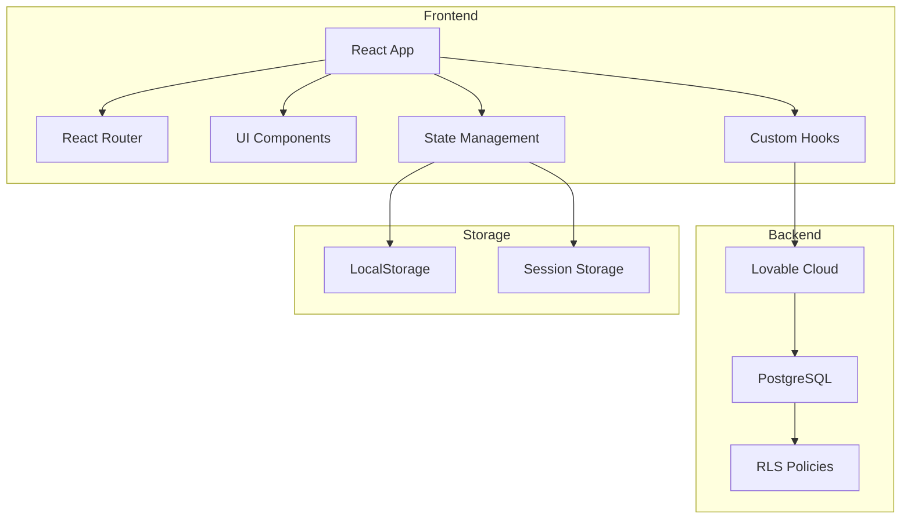
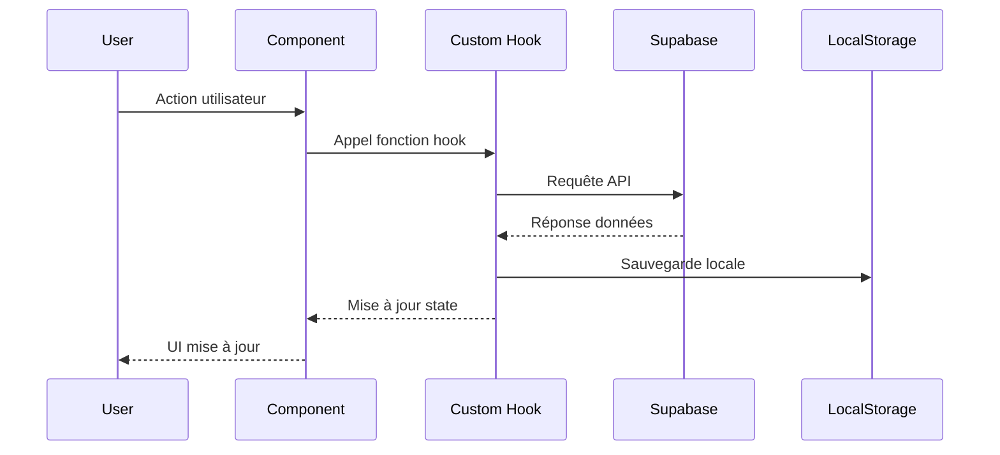
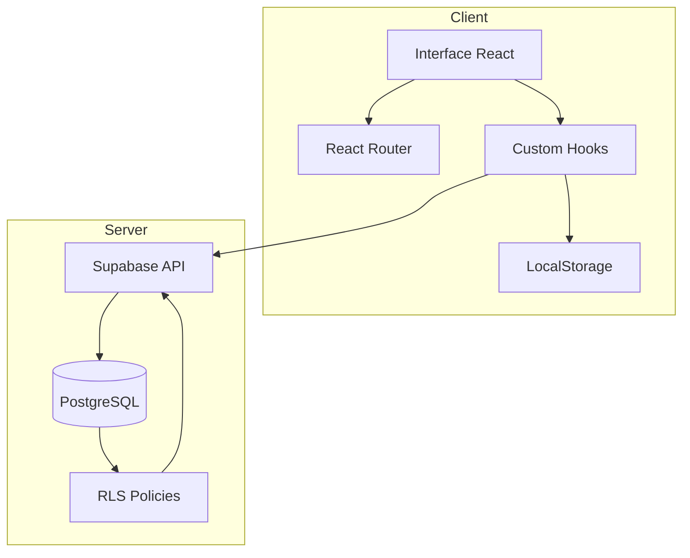

# Architecture technique

## 🏗️ Vue d'ensemble de l'architecture

Mission Navis suit une architecture moderne de Single Page Application (SPA) avec un backend serverless.



## 🎨 Stack technique détaillé

### Frontend Framework
- **React 18.3.1** - Bibliothèque UI avec hooks
- **TypeScript** - Typage statique pour la sécurité
- **Vite** - Build tool ultra-rapide
- **React Router v6** - Routing côté client

### Styling et UI
- **Tailwind CSS** - Utility-first CSS
- **Shadcn/ui** - Composants accessibles et personnalisables
- **Radix UI** - Primitives UI headless
- **Lucide React** - Icônes modernes
- **class-variance-authority** - Gestion des variants CSS

### Backend et Base de données
- **Lovable Cloud (Supabase)** - Backend as a Service
- **PostgreSQL** - Base de données relationnelle
- **Row Level Security (RLS)** - Sécurité au niveau des lignes

### Gestion d'état
- **React Hooks** (useState, useEffect, etc.)
- **LocalStorage** - Persistance locale
- **Custom Hooks** - Logique métier réutilisable

## 📂 Organisation du code

### Principe de séparation des préoccupations

```
src/
├── pages/          # Composants de page (Routes)
├── components/     # Composants réutilisables
├── hooks/          # Logique métier et data fetching
├── types/          # Définitions TypeScript
├── lib/            # Utilitaires et helpers
├── data/           # Données statiques
├── integrations/   # Clients API externes
└── assets/         # Médias et images
```

### Patterns utilisés

#### 1. **Custom Hooks Pattern**
Encapsulation de la logique métier et des appels API :

```typescript
// useGameSession.ts
export const useGameSession = () => {
  const [session, setSession] = useState<GameSession | null>(null);
  const [loading, setLoading] = useState(false);
  
  const createSession = async (playerPseudo: string) => {
    // Logique de création
  };
  
  return { session, loading, createSession };
};
```

#### 2. **Component Composition**
Composants modulaires et réutilisables :

```typescript
// Page utilisant des composants
<Card>
  <CardHeader>
    <CardTitle>Titre</CardTitle>
  </CardHeader>
  <CardContent>
    <Button>Action</Button>
  </CardContent>
</Card>
```

#### 3. **Type Safety**
Typage strict avec TypeScript :

```typescript
export interface GameSession {
  code: string;
  players: Player[];
  boxes: Box[];
  startTime: number;
}
```

#### 4. **Error Handling**
Gestion des erreurs avec try-catch et toast :

```typescript
try {
  const result = await operation();
  toast.success("Succès !");
} catch (error) {
  console.error('Error:', error);
  toast.error("Erreur lors de l'opération");
}
```

## 🔄 Flux de données



## 🗂️ Structure des composants

### Pages (Routes)
Composants de haut niveau représentant des routes :
- `Landing.tsx` - Page d'accueil
- `Connect.tsx` - Connexion/Création session
- `Dashboard.tsx` - Vue d'ensemble des boîtes
- `Quiz.tsx` - Interface de quiz
- `Unlock.tsx` - Validation de code
- `Victory.tsx` - Écran de fin

### Composants UI
Composants réutilisables de l'interface :
- Composants Shadcn/ui dans `components/ui/`
- `Timer.tsx` - Composant de compte à rebours

### Hooks personnalisés
Logique métier encapsulée :
- `useGameSession` - Gestion des sessions
- `useBoxAttempts` - Tentatives de quiz
- `useBoxUnlock` - Déverrouillage
- `usePlayerAnswers` - Réponses

## 🔐 Sécurité

### Row Level Security (RLS)
Politiques de sécurité au niveau de la base de données :
- Tous peuvent lire les données publiques
- Seuls les créateurs peuvent modifier leurs données
- Validation des codes côté serveur

### Validation des données
- Validation TypeScript au niveau du code
- Vérification des types à la compilation
- Contraintes de base de données

## 🚀 Performance

### Optimisations
- **Code splitting** - Routes lazy-loadées
- **Memoization** - React.memo pour composants lourds
- **LocalStorage** - Cache local pour sessions
- **Supabase** - Requêtes optimisées avec indexes

### Best practices
- Éviter les re-renders inutiles
- Utiliser les hooks de manière optimale
- Minimiser les appels API
- Lazy loading des images

## 🔧 Configuration

### Variables d'environnement
Gérées automatiquement par Lovable Cloud :
- `VITE_SUPABASE_URL` - URL de l'API
- `VITE_SUPABASE_PUBLISHABLE_KEY` - Clé publique
- `VITE_SUPABASE_PROJECT_ID` - ID du projet

### Fichiers de configuration
- `vite.config.ts` - Configuration Vite
- `tailwind.config.ts` - Configuration Tailwind
- `tsconfig.json` - Configuration TypeScript
- `supabase/config.toml` - Configuration Supabase

## 📊 Diagramme d'architecture complet



## 🎯 Principes de conception

1. **Separation of Concerns** - Chaque module a une responsabilité claire
2. **DRY (Don't Repeat Yourself)** - Code réutilisable via hooks
3. **Single Source of Truth** - État centralisé dans Supabase
4. **Type Safety** - TypeScript partout
5. **Progressive Enhancement** - Fonctionnalités de base toujours disponibles
