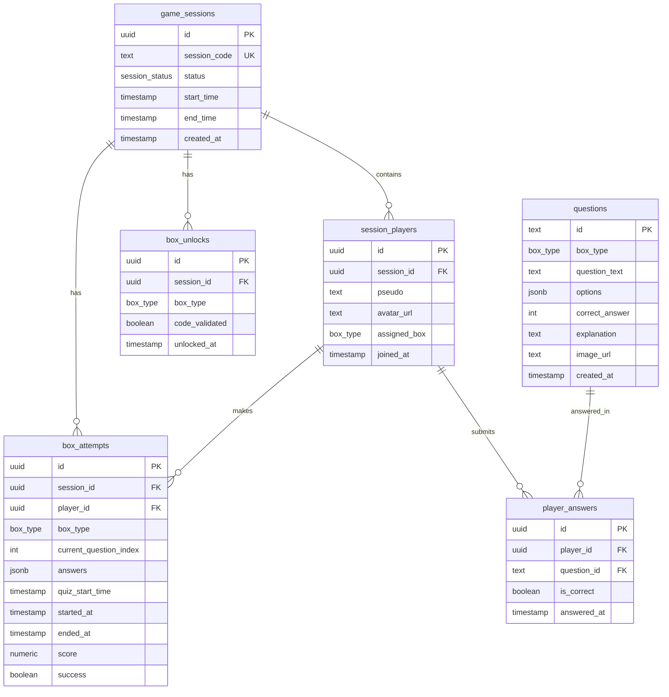

# Structure de la base de données

## 🗄️ Vue d'ensemble

La base de données PostgreSQL gère toutes les données du jeu via Lovable Cloud (Supabase). Elle utilise les Row Level Security (RLS) policies pour la sécurité.

## 📊 Schéma de la base de données



## 📋 Tables détaillées

### 1. `game_sessions`
Gère les sessions de jeu.

| Colonne | Type | Nullable | Default | Description |
|---------|------|----------|---------|-------------|
| `id` | uuid | Non | `gen_random_uuid()` | Identifiant unique |
| `session_code` | text | Non | - | Code de session (ex: BOAT-XXXX) |
| `status` | session_status | Non | `'active'` | Statut de la session |
| `start_time` | timestamp | Non | `now()` | Début de la session |
| `end_time` | timestamp | Oui | - | Fin de la session |
| `created_at` | timestamp | Non | `now()` | Date de création |

**Enum `session_status`** : `'active'`, `'completed'`, `'abandoned'`

**Index** :
- Primary key sur `id`
- Unique sur `session_code`

---

### 2. `session_players`
Joueurs dans une session.

| Colonne | Type | Nullable | Default | Description |
|---------|------|----------|---------|-------------|
| `id` | uuid | Non | `gen_random_uuid()` | Identifiant unique |
| `session_id` | uuid | Non | - | Référence à la session |
| `pseudo` | text | Non | - | Pseudo du joueur |
| `avatar_url` | text | Non | - | URL de l'avatar |
| `assigned_box` | box_type | Oui | - | Boîte assignée |
| `joined_at` | timestamp | Non | `now()` | Date de jointure |

**Enum `box_type`** : `'A'`, `'B'`, `'C'`, `'D'`

---

### 3. `box_attempts`
Tentatives de quiz sur les boîtes.

| Colonne | Type | Nullable | Default | Description |
|---------|------|----------|---------|-------------|
| `id` | uuid | Non | `gen_random_uuid()` | Identifiant unique |
| `session_id` | uuid | Non | - | Référence à la session |
| `player_id` | uuid | Non | - | Référence au joueur |
| `box_type` | box_type | Non | - | Type de boîte (A/B/C/D) |
| `current_question_index` | integer | Oui | `0` | Index de la question actuelle |
| `answers` | jsonb | Oui | `'[]'` | Tableau des réponses |
| `quiz_start_time` | timestamp | Oui | - | Début du quiz |
| `started_at` | timestamp | Non | `now()` | Date de début |
| `ended_at` | timestamp | Oui | - | Date de fin |
| `score` | numeric | Oui | - | Score obtenu |
| `success` | boolean | Oui | `false` | Quiz réussi ou non |

**Contrainte** : Une seule tentative active par boîte et session

---

### 4. `box_unlocks`
Déverrouillages des boîtes.

| Colonne | Type | Nullable | Default | Description |
|---------|------|----------|---------|-------------|
| `id` | uuid | Non | `gen_random_uuid()` | Identifiant unique |
| `session_id` | uuid | Non | - | Référence à la session |
| `box_type` | box_type | Non | - | Type de boîte déverrouillée |
| `code_validated` | boolean | Non | `false` | Code validé ou non |
| `unlocked_at` | timestamp | Non | `now()` | Date de déverrouillage |

**Contrainte unique** : `session_id` + `box_type`

---

### 5. `player_answers`
Réponses individuelles des joueurs.

| Colonne | Type | Nullable | Default | Description |
|---------|------|----------|---------|-------------|
| `id` | uuid | Non | `gen_random_uuid()` | Identifiant unique |
| `player_id` | uuid | Non | - | Référence au joueur |
| `question_id` | text | Non | - | ID de la question |
| `is_correct` | boolean | Non | - | Réponse correcte ou non |
| `answered_at` | timestamp | Non | `now()` | Date de réponse |

**Contrainte unique** : `player_id` + `question_id`

---

### 6. `questions`
Questions du quiz (lecture seule pour les joueurs).

| Colonne | Type | Nullable | Default | Description |
|---------|------|----------|---------|-------------|
| `id` | text | Non | - | Identifiant unique |
| `box_type` | box_type | Non | - | Boîte associée |
| `question_text` | text | Non | - | Texte de la question |
| `options` | jsonb | Non | - | Options de réponse (tableau) |
| `correct_answer` | integer | Non | - | Index de la bonne réponse |
| `explanation` | text | Oui | - | Explication de la réponse |
| `image_url` | text | Oui | - | URL d'une image optionnelle |
| `created_at` | timestamp | Non | `now()` | Date de création |

---

## 🔐 Row Level Security (RLS)

Toutes les tables ont RLS activé avec les politiques suivantes :

### Politiques globales

#### game_sessions
```sql
-- Lecture publique
CREATE POLICY "Sessions are viewable by everyone"
ON game_sessions FOR SELECT USING (true);

-- Création publique
CREATE POLICY "Anyone can create a session"
ON game_sessions FOR INSERT WITH CHECK (true);

-- Mise à jour publique
CREATE POLICY "Anyone can update a session"
ON game_sessions FOR UPDATE USING (true);
```

#### session_players
```sql
-- Lecture publique
CREATE POLICY "Players are viewable by everyone"
ON session_players FOR SELECT USING (true);

-- Jointure publique
CREATE POLICY "Anyone can join a session"
ON session_players FOR INSERT WITH CHECK (true);

-- Mise à jour publique
CREATE POLICY "Anyone can update players"
ON session_players FOR UPDATE USING (true);
```

#### box_attempts
```sql
-- Lecture publique
CREATE POLICY "Box attempts are viewable by everyone"
ON box_attempts FOR SELECT USING (true);

-- Création publique
CREATE POLICY "Anyone can create box attempts"
ON box_attempts FOR INSERT WITH CHECK (true);

-- Mise à jour publique
CREATE POLICY "Anyone can update box attempts"
ON box_attempts FOR UPDATE USING (true);
```

#### box_unlocks
```sql
-- Lecture publique
CREATE POLICY "Box unlocks are viewable by everyone"
ON box_unlocks FOR SELECT USING (true);

-- Déverrouillage public
CREATE POLICY "Anyone can unlock boxes"
ON box_unlocks FOR INSERT WITH CHECK (true);

-- Mise à jour publique
CREATE POLICY "Anyone can update box unlocks"
ON box_unlocks FOR UPDATE USING (true);
```

#### player_answers
```sql
-- Lecture publique
CREATE POLICY "Answers are viewable by everyone"
ON player_answers FOR SELECT USING (true);

-- Soumission publique
CREATE POLICY "Anyone can submit answers"
ON player_answers FOR INSERT WITH CHECK (true);
```

#### questions
```sql
-- Lecture seule publique
CREATE POLICY "Questions are viewable by everyone"
ON questions FOR SELECT USING (true);
```

## 🔄 Relations et contraintes

### Foreign Keys
- `session_players.session_id` → `game_sessions.id`
- `box_attempts.session_id` → `game_sessions.id`
- `box_attempts.player_id` → `session_players.id`
- `box_unlocks.session_id` → `game_sessions.id`
- `player_answers.player_id` → `session_players.id`

### Unique Constraints
- `game_sessions.session_code` - Code unique par session
- `box_unlocks (session_id, box_type)` - Une seule entrée par boîte
- `player_answers (player_id, question_id)` - Une réponse par question

## 📈 Indexes

Indexes automatiques sur :
- Primary keys (tous les `id`)
- Foreign keys (pour les jointures)
- Unique constraints (`session_code`, etc.)

## 🗃️ Données statiques

Les questions sont stockées dans `src/data/questions.ts` et insérées dans la table `questions` lors de la création de session.

## 🔍 Requêtes courantes

### Obtenir une session avec ses joueurs
```typescript
const { data } = await supabase
  .from('game_sessions')
  .select('*, session_players(*)')
  .eq('session_code', code)
  .single();
```

### Vérifier les déverrouillages d'une session
```typescript
const { data } = await supabase
  .from('box_unlocks')
  .select('box_type')
  .eq('session_id', sessionId)
  .eq('code_validated', true);
```

### Obtenir la tentative active d'une boîte
```typescript
const { data } = await supabase
  .from('box_attempts')
  .select('*')
  .eq('session_id', sessionId)
  .eq('box_type', boxType)
  .is('ended_at', null)
  .single();
```
