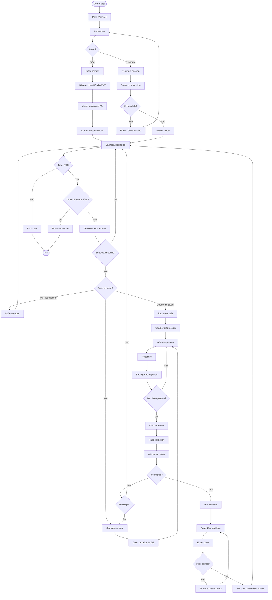
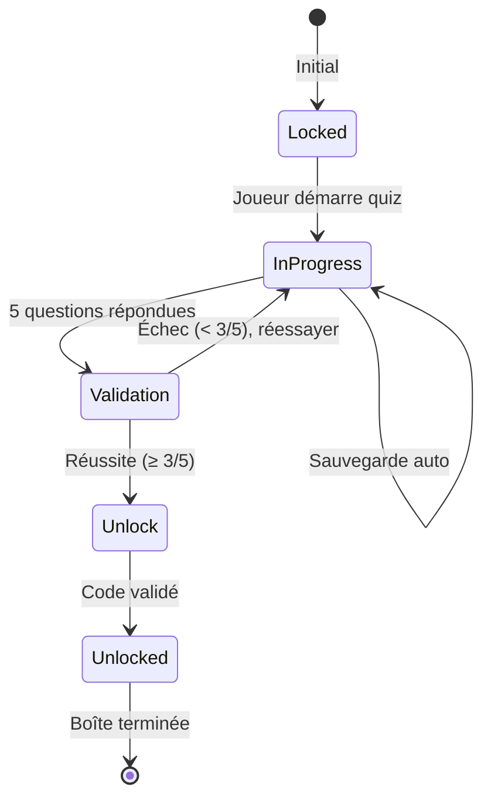

# Flux de jeu et règles

## 🎮 Vue d'ensemble du jeu

Mission Navis est un jeu collaboratif où une équipe doit déverrouiller 4 boîtes thématiques avant la fin du timer en répondant correctement à des quiz.

## 🎯 Objectif

Déverrouiller les 4 boîtes (A, B, C, D) en :
1. Répondant correctement aux questions de chaque boîte
2. Obtenant le code de déverrouillage
3. Validant le code avant la fin du temps

## ⏱️ Contraintes

- **Timer global** : 60 minutes pour toute la mission
- **Un joueur par boîte** : Une seule personne peut travailler sur une boîte à la fois
- **5 questions par boîte** : Chaque boîte contient un quiz de 5 questions
- **Code de déverrouillage** : Obtenu après avoir réussi le quiz

## 📊 Diagramme de flux complet



## 🗺️ Navigation détaillée

### 1. Landing Page (`/`)
**Objectif** : Page d'accueil avec présentation

**Actions possibles** :
- Cliquer sur "Commencer" → Redirige vers `/connect`

---

### 2. Connect Page (`/connect`)
**Objectif** : Créer ou rejoindre une session

**Formulaire** :
- Entrer un pseudo
- Choisir "Créer une session" ou "Rejoindre une session"
- Si rejoindre : entrer le code session

**Logique** :
```typescript
// Créer une session
1. Générer code unique (BOAT-XXXX)
2. Créer session en DB (game_sessions)
3. Ajouter joueur créateur (session_players)
4. Charger questions depuis data/questions.ts
5. Sauvegarder en localStorage
6. Rediriger vers /dashboard

// Rejoindre une session
1. Vérifier que la session existe et est active
2. Ajouter joueur à la session (session_players)
3. Récupérer données session
4. Sauvegarder en localStorage
5. Rediriger vers /dashboard
```

**Validations** :
- ✅ Pseudo non vide
- ✅ Code session valide (si rejoindre)
- ✅ Session active

---

### 3. Dashboard Page (`/dashboard`)
**Objectif** : Vue d'ensemble des 4 boîtes et du timer

**Affichage** :
- Timer global (60 minutes)
- Code de la session
- Liste des joueurs
- 4 boîtes avec leur statut :
  - 🔒 **Locked** (verrouillée) - Gris
  - ⏳ **In Progress** (en cours) - Orange, avec nom du joueur
  - ✅ **Unlocked** (déverrouillée) - Vert

**Actions** :
- Cliquer sur une boîte **locked** → Démarrer le quiz (`/quiz/:boxType`)
- Cliquer sur une boîte **in-progress** (même joueur) → Reprendre (`/quiz/:boxType`)
- Cliquer sur une boîte **in-progress** (autre joueur) → Bloqué avec message
- Cliquer sur une boîte **unlocked** → Aucune action

**Logique de refresh** :
```typescript
// Actualiser l'état toutes les 5 secondes
useEffect(() => {
  const interval = setInterval(() => {
    refreshSession();
  }, 5000);
  return () => clearInterval(interval);
}, []);
```

---

### 4. Quiz Page (`/quiz/:boxType`)
**Objectif** : Répondre aux 5 questions d'une boîte

**Protection** :
```typescript
// Vérifier qu'aucun autre joueur n'a commencé
const activeAttempt = await getActiveAttempt(sessionCode, boxType);
if (activeAttempt && activeAttempt.player_id !== currentPlayerId) {
  toast.error('Cette boîte est déjà en cours par un autre joueur !');
  navigate('/dashboard');
}
```

**Affichage** :
- Numéro de question (1/5, 2/5, etc.)
- Texte de la question
- 4 options de réponse
- Bouton "Suivant" (désactivé tant qu'aucune réponse sélectionnée)

**Sauvegarde automatique** :
```typescript
// À chaque réponse
useEffect(() => {
  if (attemptId && answers.length > 0) {
    saveProgress(attemptId, currentQuestionIndex, answers);
  }
}, [answers, currentQuestionIndex]);
```

**Progression** :
1. Afficher question 1
2. Utilisateur choisit une réponse
3. Clic sur "Suivant"
4. Sauvegarder réponse en DB
5. Passer à question 2
6. ... répéter jusqu'à question 5
7. Rediriger vers `/validation`

**Données sauvegardées** :
- `box_attempts` : Tentative active avec progression
- `player_answers` : Chaque réponse individuelle

---

### 5. Validation Page (`/validation`)
**Objectif** : Afficher les résultats du quiz

**Calcul du score** :
```typescript
const correctAnswers = answers.filter(a => a).length;
const score = (correctAnswers / totalQuestions) * 100;
const success = correctAnswers >= 3; // 60% minimum
```

**Affichage** :
- Score en pourcentage
- Nombre de bonnes réponses (X/5)
- État : ✅ Réussi ou ❌ Échoué
- Si réussi : Code de déverrouillage
- Boutons :
  - "Déverrouiller" (si réussi) → `/unlock`
  - "Réessayer" (si échoué) → `/quiz/:boxType`
  - "Retour au tableau de bord" → `/dashboard`

**Marquer la fin de tentative** :
```typescript
await endAttempt(attemptId, score, success);
```

---

### 6. Unlock Page (`/unlock`)
**Objectif** : Valider le code de déverrouillage

**Affichage** :
- Champ de saisie pour le code
- Bouton "Valider"

**Validation** :
```typescript
const isValid = enteredCode === box.unlockCode;
if (isValid) {
  await unlockBox(sessionCode, boxType);
  toast.success("Boîte déverrouillée !");
  navigate('/dashboard');
} else {
  toast.error("Code incorrect !");
}
```

**Sauvegarde** :
```typescript
// Insérer dans box_unlocks
{
  session_id: sessionId,
  box_type: boxType,
  code_validated: true
}
```

---

### 7. Victory Page (`/victory`)
**Objectif** : Célébrer la victoire

**Condition d'accès** :
```typescript
// Vérifier que les 4 boîtes sont déverrouillées
const unlockedCount = session.codesValidated.length;
if (unlockedCount === 4) {
  navigate('/victory');
}
```

**Affichage** :
- Message de félicitations
- Temps total écoulé
- Liste des joueurs participants
- Bouton "Nouvelle mission" → Retour à `/`

---

## 📦 États des boîtes

### Statut : **Locked** 🔒
- Boîte pas encore commencée
- Couleur : Gris
- Action : Cliquer pour démarrer

### Statut : **In Progress** ⏳
- Un joueur a commencé mais pas terminé
- Couleur : Orange
- Affichage : Nom du joueur en cours
- Actions :
  - Même joueur : Reprendre
  - Autre joueur : Bloqué

### Statut : **Unlocked** ✅
- Quiz réussi et code validé
- Couleur : Vert
- Action : Aucune (boîte terminée)

## 🔄 Système de sauvegarde et reprise

### Sauvegarde automatique
```typescript
// Sauvegarde toutes les 2 secondes
useEffect(() => {
  const autosave = setInterval(() => {
    if (attemptId && answers.length > 0) {
      saveProgress(attemptId, currentQuestionIndex, answers);
    }
  }, 2000);
  return () => clearInterval(autosave);
}, [attemptId, answers, currentQuestionIndex]);
```

### Reprise de progression
```typescript
// Au chargement de la page Quiz
useEffect(() => {
  const activeAttempt = await getActiveAttempt(sessionCode, boxType);
  if (activeAttempt && activeAttempt.player_id === currentPlayerId) {
    // Restaurer l'état
    setAttemptId(activeAttempt.id);
    setCurrentQuestionIndex(activeAttempt.current_question_index);
    setAnswers(JSON.parse(activeAttempt.answers));
    setQuizStartTime(new Date(activeAttempt.quiz_start_time).getTime());
  }
}, []);
```

## ⏲️ Gestion du timer

### Timer global (60 minutes)
```typescript
// Calcul du temps restant
const timeElapsed = Date.now() - session.startTime;
const timeRemaining = GAME_DURATION - timeElapsed;

if (timeRemaining <= 0) {
  // Fin du jeu
  toast.error("Temps écoulé !");
  navigate('/dashboard');
}
```

### Format d'affichage
```typescript
const minutes = Math.floor(timeRemaining / 60000);
const seconds = Math.floor((timeRemaining % 60000) / 1000);
return `${minutes}:${seconds.toString().padStart(2, '0')}`;
```

## 🎲 Les 4 boîtes thématiques

| Boîte | Thème | Couleur | Code déverrouillage |
|-------|-------|---------|---------------------|
| **A** | 🎨 Arts et Culture | Violet | `ART2024` |
| **B** | 🌍 Environnement | Vert | `ECO2024` |
| **C** | ⚕️ Santé | Rouge | `HEALTH2024` |
| **D** | ✈️ Tourisme | Bleu | `TRAVEL2024` |

Chaque boîte contient **5 questions** avec **4 options** de réponse.

## 🏆 Critères de réussite

### Pour une boîte
- ✅ Répondre correctement à **au moins 3 questions sur 5** (60%)
- ✅ Obtenir et valider le code de déverrouillage

### Pour la mission complète
- ✅ Déverrouiller les **4 boîtes** (A, B, C, D)
- ✅ Avant la fin du **timer de 60 minutes**

## 🔄 Cycle complet d'une boîte



## 💾 Stockage local

### LocalStorage
```typescript
// Données sauvegardées
localStorage.setItem('current_session_code', sessionCode);
localStorage.setItem('current_player_id', playerId);
localStorage.setItem('current_player_pseudo', pseudo);
```

### Session
Données synchronisées avec Supabase :
- État des boîtes
- Progression des quiz
- Réponses des joueurs
- Déverrouillages

## 🚫 Règles de validation

### Session
- ❌ Impossible de rejoindre une session terminée
- ❌ Le code session doit être valide
- ✅ Plusieurs joueurs peuvent rejoindre

### Boîtes
- ❌ Un seul joueur par boîte à la fois
- ❌ Impossible de déverrouiller sans le bon code
- ✅ Possible de réessayer un quiz échoué

### Quiz
- ❌ Impossible de passer à la question suivante sans répondre
- ❌ Impossible de revenir en arrière
- ✅ Sauvegarde automatique de la progression
